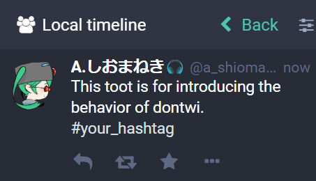
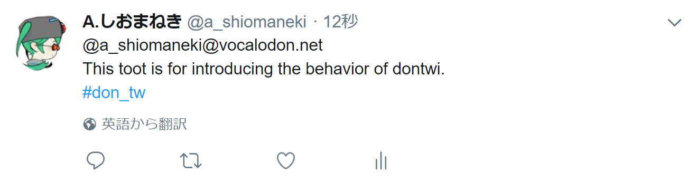

======
dontwi
======

About
======

dontwi_ is a status transporter script from Mastodon instances to Twitter. 
It transports statuses triggered by your preferred hashtag in Mastodon public timeline to a twitter account with `#don_tw` hashtag. 
Its aim is communication with Mastodon users and the Twitter's follers. 

.. _dontwi: https://github.com/vocalodon/dontwi

Features
--------

- dontwi supports Python 3.4 and higher on CentOS 7.4 and Windows 10.
- Efficiently to use with ``cron``. It transports only one status each run. 
- Statues with the specified tag in Mastodon public local timeline are transferred.
- Long text in Mastodon status is truncated to fit for Twitter.
- Username at Mastodon is attached to Twitter status. 
- The attached image is also transported with status text.
- Statuses recorded as sent has never been sent again.

How it works
============

dontwi transports statuses with a specific hashtag on Mastodon's local timeline. For example, Fig.1 status on Mastodon is brought to Twitter like Fig.2.

Fig.1 Sample status on Mastodon

Fig.2 Transported status on Twitter

dontwi gets hashtag timeline each run using Mastodon API. When it finds the statuses with the target hashtag and stores in the log DB.

Next, it takes the oldest status from the log DB, posts the status to Twitter by API. It appends the contributor's address on Mastodon and ``#don_twi`` hashtag to the status. Also, it brings attached media files [#f1]_ which is shrunk for Twitter if the resolution exceeds Twitter's specifications.

All of the contents that are text, link address, and hashtag are kept if the number of characters is within 280, which is the limit of Twitter. When the length exceeds the limit, dontwi trims text without modification link and hashtag as much as possible.

``#don_twi`` hashtag appended to the post to Twitter is not configurable. The reason why is aiming to organize federation timeline like Mastodon's one on Twitter by this fixed hashtag. If you want to use another hashtag, you can do by modification to source code directory. However, we hope you keep this hashtag for the federation timeline on Twitter.

.. [#f1] This is only available for image files.

Installation
============

You can easily install dontwi package from this repository using ``pip3`` via::

    pip3 install https://github.com/vocalodon/dontwi/releases/download/v1.0.0rc1/dontwi-1.0-py3-none-any.whl

You can also use ``setup.py`` to install from your local repository via::

    python3 setup.py install

Settings
========

1. Place the configuration file
--------------------------------

You should place the configuration file ``dontwi.ini`` to ``/etc``. Search paths of ``dontwi.ini`` are ``/etc`` and current directory. You can use `examples/dontwi.ini`_ as a template via::

    [operation]
    inbound = your_mastodon
    trigger = hashtag:your_hashtag
    outbound = dontwi

    [endpoint your_mastodon]
    type = mastodon
    api_base_url = https://your_mastodon.domain
    client_name = dontwi
    since = 

    [endpoint dontwi]
    type = twitter
    app_key = 
    app_secret = 
    oauth_token = 
    oauth_token_secret = 
    message_length = 280

    [result log]
    db_file = /var/db/dontwi_log.db

..  _`examples/dontwi.ini`: examples/dontwi.ini

2. Modify configuration for your instance
-----------------------------------------

You should modify ``dontwi.ini`` for your Mastodon instance and Twitter account. Required minimum modification parameters are below.
It is better not to write comments because of dontwi deletes these when saving Mastodon's client keys.

``operation`` section
+++++++++++++++++++++

``inbound``
    Section name of the inbound endpoint parameters

    You can change this name. However, keep the name consistent with the section name of endpoint definition.       

``trigger``
    Hashtag to detect status you want to transfer

    Set the hashtag with prefix ``hashtag:`` and without ``#`` mark.

``outbound``
    Section name of the inbound endpoint parameters

    See above note for ``inbound`` setting.

``endpoint your_mastodon`` section
++++++++++++++++++++++++++++++++++

``type``
    Type name of endpoint

    Set ``mastodon``. In the future, we may implement another type support. 

``api_base_url``
    Set base URL of your Mastodon instance.

``client_name``
    Client name at API access

``endpoint dontwi`` section
+++++++++++++++++++++++++++

``type``
    Type name of endpoint

    Set ``twitter``. In the future, we may implement another type support.

``app_key``, ``app_secret``, ``oauth_token``, ``oauth_token_secret``
    Set Twitter API key and related parameters. dontwi uses Twython_ library to access to Twitter. Please refer Twython's documents to obtain these keys.  

.. _Twython: https://github.com/ryanmcgrath/twython

``result log`` section
++++++++++++++++++++++

``db_file`` 
    Log DB file path

    Set log DB file path. Default is ``dontwi_log.db`` on current directory. We recommend using ``/var/db/dontwi_log.db`` according to FHS_.

.. _FHS: https://wiki.linuxfoundation.org/lsb/fhs

3. Check your configuration
---------------------------

You can confirm dontwi installation by a test run with ``--help`` option  via::

    [root@centos7 opt]# dontwi --help
    usage: dontwi [-h] [--config-file CONFIG_FILE] [--summary] [--trigger TRIGGER]
                  [--since SINCE] [--until UNTIL] [--limit LIMIT] [--dry-run]
                  [--get-secret] [--dump-status-strings] [--dump-log]
                  [--dump-log-readable] [--remove-waiting] [--remove-wrong]
                  [--db-file DB_FILE]

    A status transporter from Mastodon to Twitter

    optional arguments:
      -h, --help            show this help message and exit
      --config-file CONFIG_FILE
                            Using CONFIG_FILE instead of the default.
      --summary             Showing summary of log DB
      --trigger TRIGGER     Using TRIGGER instead of trigger in config file
      --since SINCE         Using SINCE instead of since in config file
      --until UNTIL         Using UNTIL instead of until in config file
      --limit LIMIT         Using LIMIT instead of limit in config file
      --dry-run             Getting the last status with the hashtag, but don't
                            send status to outbound service.
      --get-secret          Getting client id and others from Mastodon instance and saving these in the config file.
      --dump-status-strings
                            Dumping status strings to be marked as 'Waiting'
                            status
      --dump-log            Dumping all records in the log database.
      --dump-log-readable   Dumping all records in the log database in a human-
                            readable format.
      --remove-waiting      Removing records in 'Waiting' from the database
      --remove-wrong        Removing records in 'Waiting' from the database
      --db-file DB_FILE     Using log DB_FILE instead of db_file of [result log]
                            section in the config file.

If some installation problems remain, you see the error message at above test.

For confirmation of ``dontwi.ini``,  run ``dontwi`` with ``--dry-run`` via::

    [root@centos7 ~]# dontwi --dry-run
    Test at 2018-02-17T14:04:05.826111+00:00 in:your_mastodon,4705377 out:, tag:どんつい

When first accessing to your Mastodon instance, dontwi saves the access keys in ``config.ini``. 

When you execute dontwi with ``--dry-run``,  dontwi gets a tag timeline of your Mastodon instance via `Timelines API`_ and prepares statuses to Twitter. dontwi prepares to post the oldest status in API response to Twitter, however, does not until post. This process is logged with 'Test' label. Other status texts are queued for next run with 'Waiting' label. While remaining in the queue, post one status from the queue on each run.

.. _`Timelines API`: https://github.com/tootsuite/documentation/blob/master/Using-the-API/API.md#timelines

You can see the number of these labels in the log DB by ``--summary`` option via::

    [root@centos7 opt]# dontwi --summary
    dontwi version  1.0
    log db  {'application': 'dontwi', 'version': '1.0'}
    record number   25
    Start   0
    Waiting 23
    Succeed 0
    Failed  0
    Test    2

Because labeled entries not specified with ``Waiting`` will not be processed, so delete the ``Test`` entries using ``--remove-wrong`` option before starting operation.::

    [root@centos7 opt]# dontwi --remove-wrong

In this process, other failure-related entries will be deleted.

After the above preparation, you can test run. Simply execute ``dontwi``::

    [root@centos7 ~]# dontwi
    Succeed at 2018-02-17T14:04:05.826111+00:00 in:your_mastodon,4705377 out:, tag:どんつい

4. Add entry to crontab
-----------------------

Let's add dontwi entry to crontab. Examaple is below::

    */2  *  *  *  * root       /usr/bin/dontwi

Above entry means run dontwi each 2 minute. Also, refer `examples/crontab`_/

.. _`examples/crontab`: example/crontab

If you prefer ``systemd``, you can use `examples/dontwi.service`_ and `examples/dontwi.timer`_.

.. _`examples/dontwi.service`: examples/dontwi.service
.. _`examples/dontwi.timer`: examples/dontwi.timer

License
=======

Copyright  2017 `A.しおまねき(acct:a_shiomaneki@vocalodon.net)`_

Dontwi is licensed under the `GNU General Public License v3.0`_.
See `LICENSE`_ for the troposphere full license text.

.. _`GNU General Public License v3.0`: https://www.gnu.org/licenses/gpl-3.0.en.html
.. _`LICENSE`: https://github.com/vocalodon/dontwi/blob/master/LICENSE
.. _`A.しおまねき(acct:a_shiomaneki@vocalodon.net)`: https://vocalodon.net/@a_shiomaneki

Acknowledgements
================

- `左手(acct:lefthand666@vocalodon.net)`_, `TOMOKI++(acct:tomoki@vocalodon.net)`_ and users in `vocalodon.net`_ for original ideas and a lot of motivation.
- `TOMOKI++(acct:tomoki@vocalodon.net)`_ for providing the server and testing.
- `rainyday(acct:decoybird@vocalodon.net)`_ for providing initial OAuth code.

.. _`左手(acct:lefthand666@vocalodon.net)`: https://vocalodon.net/@lefthand666
.. _`TOMOKI++(acct:tomoki@vocalodon.net)`: https://vocalodon.net/@tomoki
.. _`rainyday(acct:decoybird@vocalodon.net)`: https://vocalodon.net/@decoybird
.. _`vocalodon.net`: https://vocalodon.netfer 